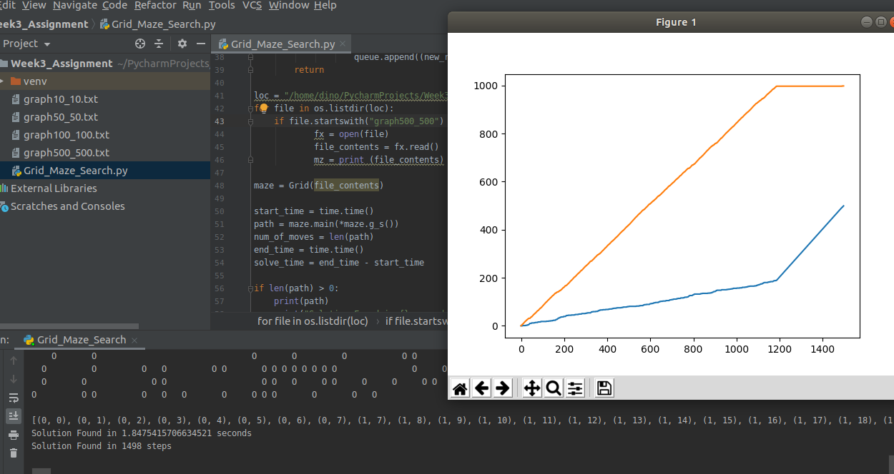

  
  
    

# Breadth-First Search (BFS) Algorithm
## Introduction
The following Python libraries were utilized: random, time, os, and matplotlib. The [*Random_Maze.py*](https://github.com/prespafree1/BFS-Algorithm/blob/main/Random_Maze.py) file generates a random maze with obstacles accounting for 30% of the total maze size. This newly generated maze is then saved as a .txt file which then gets opened and read in the Grid_Maze_Search.py file. The [*Grid_Maze_Search.py*](https://github.com/prespafree1/BFS-Algorithm/blob/main/Grid_Maze_Search.py) file solves the maze by first reading the maze from a text file from a directory and then using Breadth-First-Search (BFS) solving the maze. Cost function was also computed for each maze size by dividing the number of moves it took to solve the maze by the solve time. The start point on the maze is marked with “S” at the top left corner of the maze. The goal point of the maze is marked with “G” at the bottom right corner of the maze. Randomly generated obstacles are marked with “O” on the maze. The point robot is not allowed to visit an obstacle cell. The point robot is supposed to traverse the maze horizontally.  

## Results
Image below summarizes the cost function for each grid(maze) problem. The BFS algorithm per the data below indicates that the cost function decrease as maze size increases. It can be observed that the maze size of 500x500 has the lowest cost function from the rest of the maze sizes.  
  

### Maze 10x10
The solved path provided by the algorithm is provided in the image below as an array. The “S” start
position is always (0,0). The path values are also plotted as shown below.  
  

### Maze 50x50
The solved path provided by the algorithm is provided in the image below as an array. The “S” start
position is always (0,0). The path values are also plotted as shown below.  
  

### Maze 100x100
The solved path provided by the algorithm is provided in the image below as an array. The “S” start
position is always (0,0). The path values are also plotted as shown below.  
  

### Maze 500x500
The solved path provided by the algorithm is provided in the image below as an array. The “S” start
position is always (0,0). The path values are also plotted as shown below.  
  
